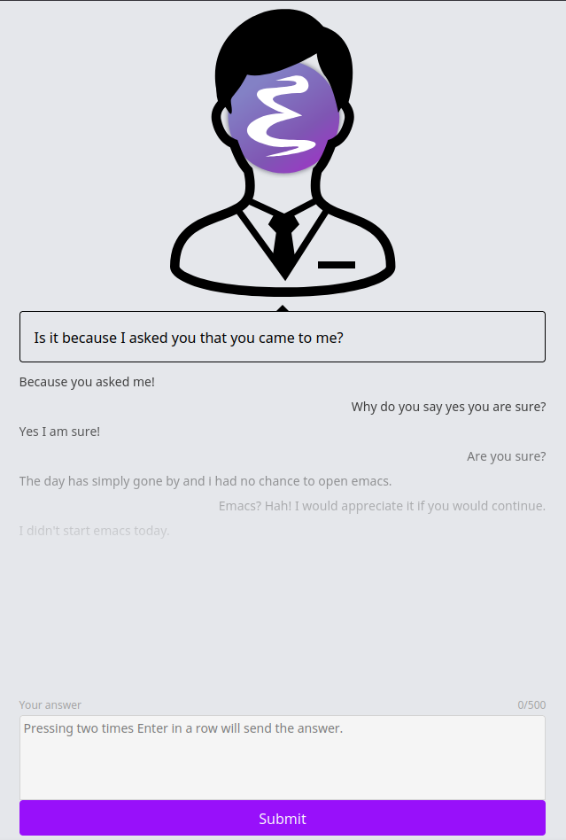

# Emacs Web Doctor

Ever found yourself on a machine without Emacs, in desperate need of a session with the built-in therapist? Despair no more! This project brings the classic `M-x doctor` command to your web browser.

This is an educational project to get some experience connecting a Svelte frontend with a Go backend, which in turn interacts with a headless Emacs instance.


<div align="center">
  
</div>


## Getting Started

1. Start the project using Docker/Podman Compose:

   ```
   podman compose up -d
   ```

2. Connect to the container:

   ```
   podman exec -it emacs-web-doctor-backend /bin/bash
   podman exec -it emacs-web-doctor-frontend /bin/bash
   ```

4. Inside the frontend container, ensure all packages are installed:

   ```
   npm i
   ```

5. Run the development server and backend server:

   ```
   npm run dev
   ```

   ```
   go run main.go
   ```
